# FlightDeck

Display and control faces for **every Roon zone** — a Roon add-in, not a RHEOS feature.

FlightDeck pairs with your Roon Core as an ordinary extension and subscribes to zones, which is core-wide.
That means it serves RHEOS rooms and Roon Ready rooms alike, and needs nothing from RHEOS.

- **Room Face** `/<room>` (for example `/study`) — a now-playing screen for a chosen room. Existing `/face/<zoneId>` bookmarks also work.
- **The Deck** `/` — every zone at a glance, ordered by **most recently played**.

*FlightDeck is not affiliated with or certified by Roon Labs. "for Roon" is descriptive only.*

## Example screens

- [The Deck (live 22 zones)](docs/wall-live-22-zones.png)
- [Presence face (live album art)](docs/face-presence-live.png)
- [Wheel face (artist sample)](docs/face-dial-artist.png)
- [Classic face (album sample)](docs/face-classic.png)
- [Libretto face (album sample)](docs/face-libretto.png)

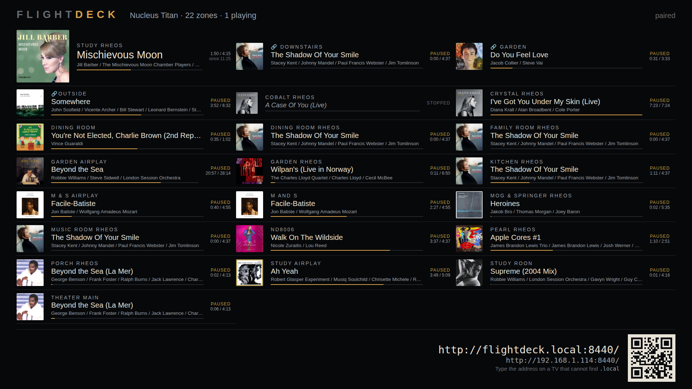

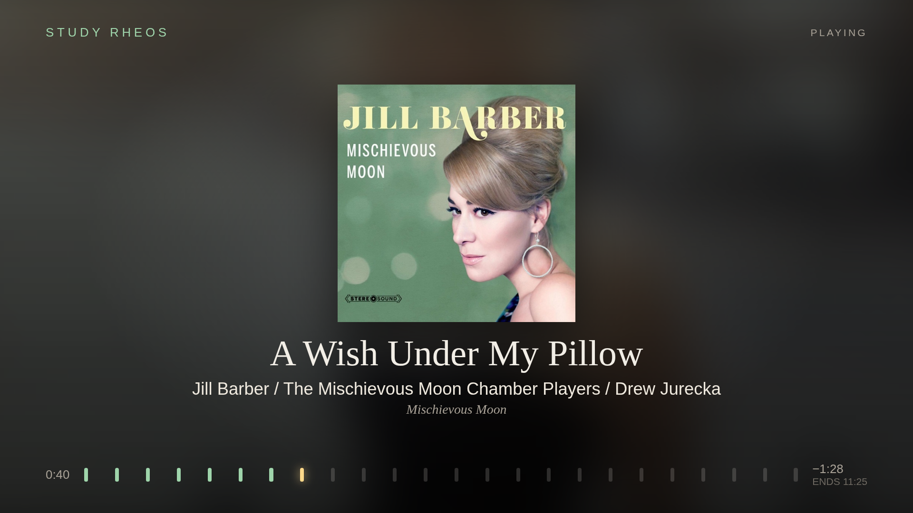

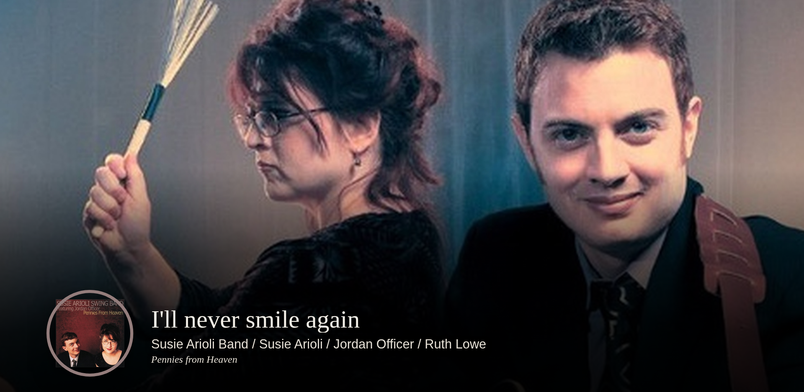

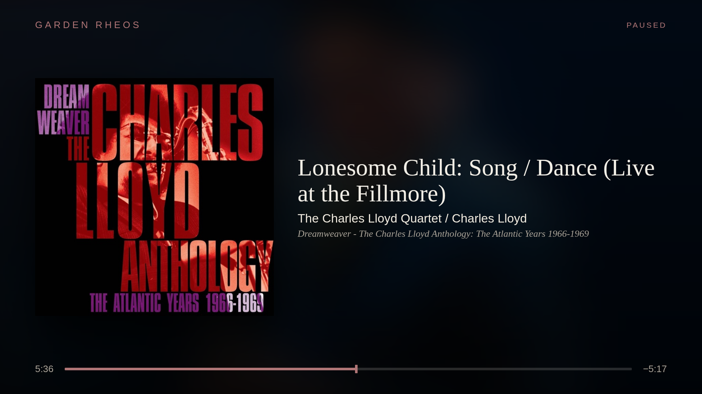

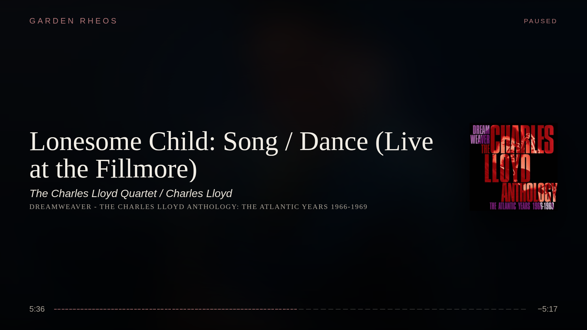

## Control examples

- [Face controls (non-puck, full chrome)](docs/face-controls.png) (transport, seek/progress, face switching, volume)
- [Face controls (revealed chrome)](docs/face-revealed.png) (transport row + volume scale over live art)
- [Deck controls (live zones)](docs/wall-live-22-zones.png) (quick room actions + inline control rows)

These views include the control chrome (transport + seek/progress + volume) so you can see how interaction works,
not just the art direction.

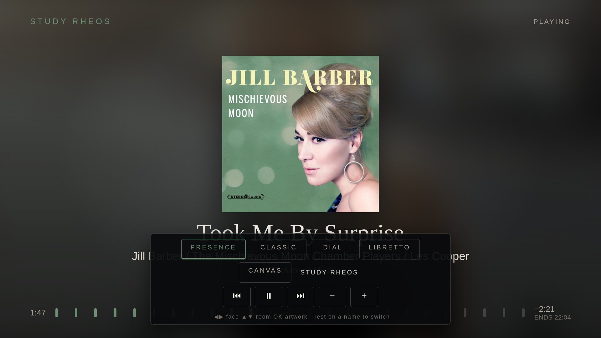

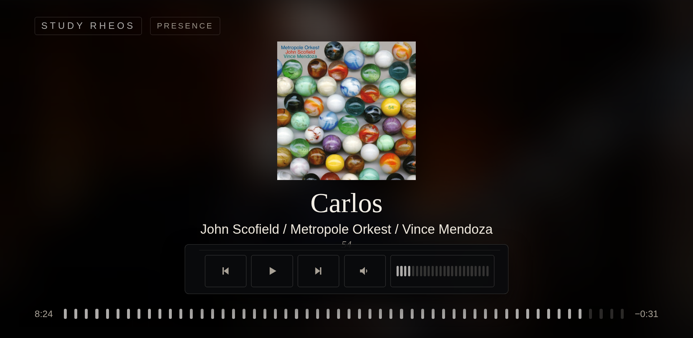


## Browse examples (controls + depth)

- [Browse genres](docs/browse-genres.png) (top-level category controls)
- [Browse composers](docs/browse-composers.png) (deeper catalog branch)
- [Browse albums](docs/browse-albums.png) (cover-rich result level)
- [Browse alphabet rail](docs/browse-alphabet.png) (fast jump control for large libraries)

Typical depth looks like:

- Genres -> Artists -> Albums -> Tracks
- Composers -> Works -> Recordings

The screenshots below show both the browse controls and the hierarchy depth in live navigation states.

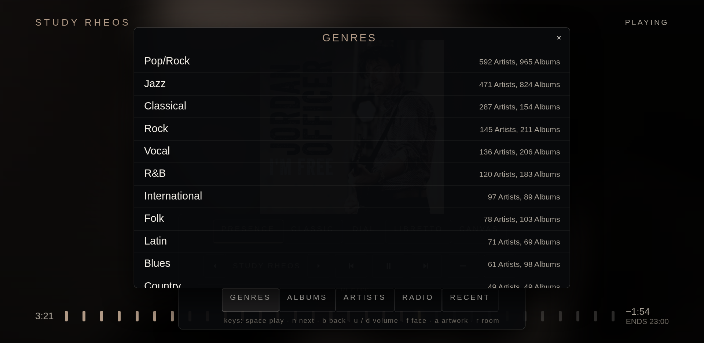

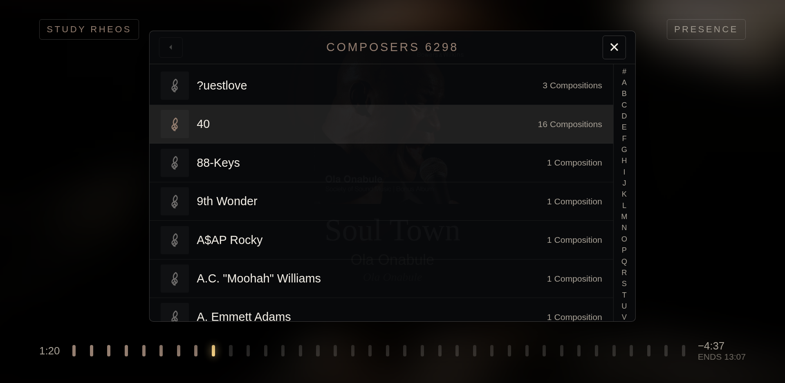

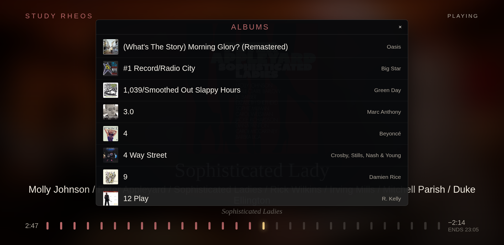

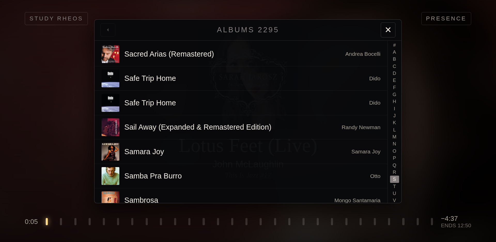

## Audio quality metadata

Sample rate and bit depth are not currently shown in FlightDeck.

At the moment, the extension path used here provides now-playing lines, artwork, transport state, and seek/length,
but not a stable sample-rate/bit-depth field in this UI model.

If Roon exposes those fields to extensions in a future API path, FlightDeck can add them.

## Why it exists

Roon's own Display is a **push** model: the Core owns the display session, the app starts it onto a zone, and
when the session lapses the screen has no authority to recover. The community record is consistent — it
freezes after 10–20 minutes, times out to a screensaver, vanishes from the Displays list, and needs a human
with a remote.

> A Roon Display is something Roon does **to** a screen.
> A FlightDeck Face is something a screen does **for itself**.

The screen owns its zone and its face (URL + local memory); the server holds no per-screen state; nothing to
start and nothing to expire. A client-side 25-second no-frame watchdog closes and reopens the stream, because
`EventSource` never notices a half-open TCP socket — which *is* the "freezes after 20 minutes" symptom.

## Quick install (2 minutes)

FlightDeck is installable now from source. It is not in Roon Extension Manager yet.

1. Install Node.js 24+.
2. Copy/paste:

```bash
git clone https://github.com/LINVALE/FlightDeck.git
cd FlightDeck
npm install
npm start
```

3. In Roon: **Settings -> Extensions** -> enable **FlightDeck**.
4. Open the URL printed in the terminal on your phone, tablet, or TV browser.

If `flightdeck.local` does not resolve on a device, use the LAN IP URL instead (`http://<your-lan-ip>/`).

**With Docker:** one image, on port 8440, for amd64 and arm64 — see [release/INSTALL-DOCKER.md](release/INSTALL-DOCKER.md).
RHEOS's installer adds the same image beside RHEOS, with an On/Off switch in RHEOS's settings.

## Optional configuration

- `FLIGHTDECK_PORT`: defaults to `80` (falls back to `8440`)
- `FLIGHTDECK_DATA`: defaults to `./data`
- `FLIGHTDECK_NAME`: defaults to `flightdeck`

Advanced network setup notes are in `docs/tv-setup.md`.

## On a TV

Samsung, LG and Fire TV each need a slightly different setup, and one shared trick:
make the address short with a router DNS record so it is typeable on a remote.
Step-by-step per platform, including why no native app exists: **`docs/tv-setup.md`**.

## Faces

All five are **user-selectable** — the ranking below decides what loads first, not what survives.

| Face | `?face=` | Signature |
|------|----------|-----------|
| **Presence** (default) | `presence` | Blurred artist behind an untouched cover; progress is a runway of approach lamps |
| Wheel | `wheel` (old `dial` links still work) | A ring instrument opposite the cover; remaining time and `ENDS hh:mm`; idle becomes a clock |
| Classic-Plus | `classic` | Roon's grammar done properly; the largest cover |
| Ambient Canvas | `canvas` | A generative field in the cover's own colours |
| Libretto | `libretto` | Concert-programme typography |

`?face=` always wins; otherwise the screen remembers per zone. On a TV, arrow keys cycle faces.

We preserve album art unchanged except in the puck interface.

## Browser floor

Chromium 63 (Samsung 2019+, LG 2020+) and iPadOS Safari 15. That rules out `clamp()`, container queries,
`aspect-ratio`, `conic-gradient`, `backdrop-filter`, flex `gap`, `?.` and `??`. The progress ring is SVG
`stroke-dashoffset`; blur is a tiny canvas scaled up.

## Development

```bash
npm test
npm run lint:floor
node scripts/preview.ts
```

The Roon packages (`node-roon-api`, `-transport`, `-browse`, `-settings`, all Apache-2.0) install with `npm install`.

## Status

FlightDeck is available as an early public build with core screens, controls, and browse flows in place.
For a live validation checklist, see `docs/tv-drill.md`.

## Licence

**FSL-1.1-MIT** — Functional Source License 1.1, MIT Future License. Copyright 2026 Peter Richardson.
Full text in [`LICENSE`](LICENSE); the same licence RHEOS carries, deliberately, so code moves freely between
the two repositories.

FSL is a **Fair Source / source-available** licence — **not** an open-source one. The source is published and
you may read it, run it, and modify it for your own use: internal use and access is an express permitted
purpose, which covers everything a home user or tester actually does. What it withholds is competing
commercial use — you may not sell it or build a competing commercial product on it. That restriction is
time-limited, not permanent: **each version converts to MIT two years after its release**, at which point it
becomes open source in the ordinary sense.

### Money and code

**Optional donations.** FlightDeck is free and stays free. If it earns a place on your screen you may support
the work, entirely at your discretion. A donation funds development — it does not purchase support, a warranty,
a feature, or any priority. The licence disclaims warranty and there is no support undertaking.

**We are not currently accepting code contributions.** Bug reports, logs and hardware observations are very
welcome and genuinely useful. Patches and pull requests are not being accepted at this time, so that copyright
in the work stays with a single holder.

### Third-party

- **Lucide** (ISC) — genre and category icons, vendored into `assets/icons/`. See
  [`THIRD-PARTY-NOTICES.md`](THIRD-PARTY-NOTICES.md).
- **`node-roon-api`, `-transport`, `-image`** (Apache-2.0) — runtime dependencies, not vendored. Their licence
  texts ship with any distributed bundle.

*FlightDeck is not affiliated with or certified by Roon Labs.*

## Browser support

FlightDeck targets **recent smart-TV browsers**. A TV whose built-in browser is too old is served by a **Fire TV
stick or Roku**, not by a compatibility layer — transpiling and polyfilling the client is explicitly out of scope
for this project.

The client uses template literals, `class`, spread, optional chaining, `fetch()` and `EventSource`. On a browser
that predates those the script fails at **parse**, so the page paints its shell and sits on "connecting…" forever.
**A stuck "connecting…" on an old TV is a SyntaxError, not a network or API fault** — don't debug it as one.
Example observed case: Samsung built-in browser, `Copyright 2010`, `BIN_B:170210_1.1.527`.

`/now` is not a lighter page — `/now`, `/face` and `/face/` all route to the same `renderFacePage`.
